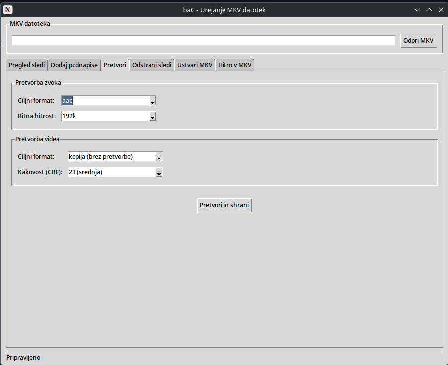
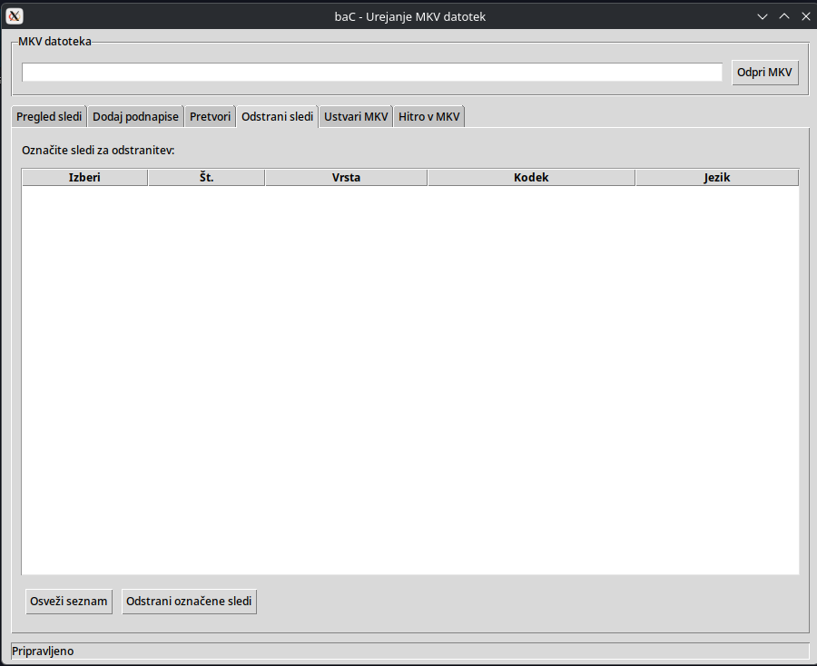
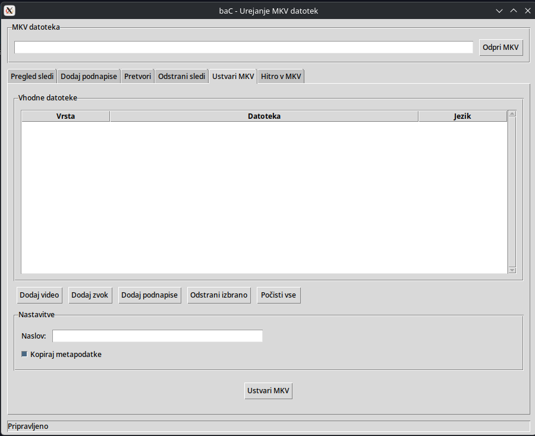
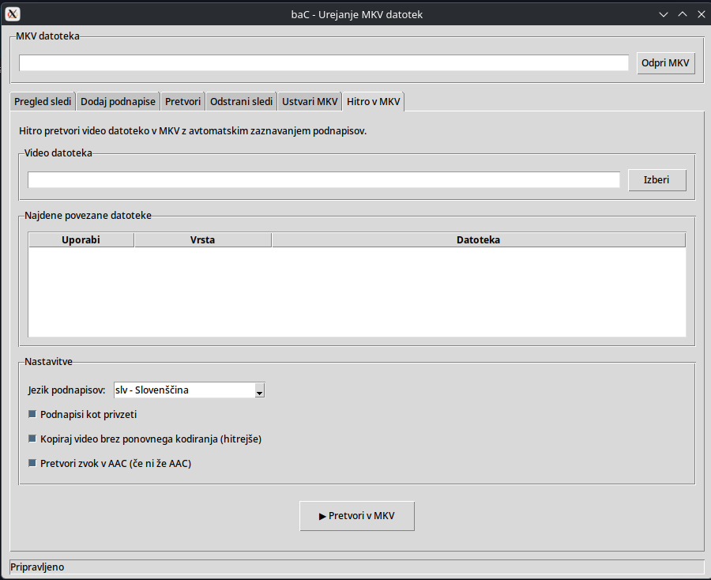

# baConverter (bac) 🔧

`baConverter` (skripta `bac.py`, ukaz `bac`) je orodje za urejanje in združevanje MKV datotek. Ponuja grafični vmesnik za urejanje MKV in uporabno ukazno vrstico za hitro obdelavo video vsebin v trenutnem imeniku.

## Funkcije ✅

- Dodajanje podnapisov v MKV
- Nastavljanje privzetih podnapisov
- Dodajanje in/ali pretvorba zvočnih sledov (v AAC) po potrebi
- Združevanje videa in podnapisov v `.mkv`
- Podpora za povleci in spusti v GUI (če so na voljo dodatki)
- Hiter CLI način za obdelavo trenutnega imenika

## Zahteve ⚙️

- Python 3
- `mkvmerge` (MKVToolNix) — obvezno za združevanje in CLI
- `ffmpeg` in `ffprobe` — priporočeno za pretvorbe in prepoznavo kodakov
- `python3-tk` (tkinter) — za GUI
- opcijsko: `tkinterdnd2` ali `tkdnd` za povleci in spusti v GUI

### Namestitev (primer: Debian/Ubuntu)

```bash
sudo apt update
sudo apt install -y ffmpeg mkvtoolnix python3-tk
python3 -m pip install --user tkinterdnd2
```

Za uporabnike Flatpak-a (opcijsko):

```bash
flatpak install flathub org.ffmpeg.FFmpeg
flatpak install flathub org.bunkus.mkvtoolnix
```

Za lažji ukaz iz terminala (po želji):

```bash
chmod +x bac.py
sudo ln -s $(pwd)/bac.py /usr/local/bin/bac
```

## Uporaba

### GUI

- Zaženi: `python3 bac.py` ali `bac` (če je nameščen).
- V GUI odpri MKV datoteko, dodaj podnapise ali zvočne datoteke (gumb ali povleci in spusti), nastavi jezik/privzeto sled in zaženi obdelavo.

### CLI

Hiter način za obdelavo trenutnega imenika:

- `python3 bac.py -q`  — hitro združi video + srt, ohrani izvorne datoteke
- `python3 bac.py -qq` — kot zgoraj, vendar izbriše izvorne datoteke po uspehu

CLI poišče video datoteke (.mp4, .avi, .mov, ...), poišče pripadajoče `.srt` datoteke z enakim imenom, po potrebi pretvori zvok v AAC in ustvari `.mkv` z združenimi podnapisi.

## Galerija slik 🖼️

Kliknite na sličico za ogled v polni velikosti. (Klik odpre sliko v novi kartici.)

<table>
<tr>
<td align="center">
<a href="slike/slika1.png" target="_blank"></a>
</td>
<td align="center">
<a href="slike/slika2.png" target="_blank"></a>
</td>
<td align="center">
<a href="slike/slika3.png" target="_blank"></a>
</td>
</tr>
<tr>
<td align="center">
<a href="slike/slika4.png" target="_blank"></a>
</td>
<td align="center">
<a href="slike/slika5.png" target="_blank"></a>
</td>
<td align="center">
<a href="slike/slika6.png" target="_blank"></a>
</td>
</tr>
</table>

## Pogoste težave ❗

> Če program opozori, da manjkajo orodja, namestite `ffmpeg` in `mkvtoolnix`. CLI zahteva `mkvmerge` in se bo ustavil, če ga ni.

## Licenca

Projekt je licenciran pod MIT licenco. Glej `LICENSE`.

